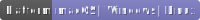

[](https://github.com/GeorgKZ/Candle/actions/workflows/build_cmake.yml)
[](https://www.gnu.org/licenses/gpl-3.0)
[](https://ru.wikipedia.org/wiki/%D0%9E%D0%BF%D0%B5%D1%80%D0%B0%D1%86%D0%B8%D0%BE%D0%BD%D0%BD%D0%B0%D1%8F_%D1%81%D0%B8%D1%81%D1%82%D0%B5%D0%BC%D0%B0)
[](https://www.qt.io/product/qt6)


Введение
========

Программа SvgToRaster была написана для простого преобразования квадратного файла-значка
векторного формата в файл растрового формата, используя возможности Qt (чтобы
не изобретать очередной велосипед). Назначение программы предполагается в преобразовании
единственного файла-значка в формате SVG в файлы-значки требуемых для целевой операционной
системы форматов (PNG, XPM, ICO, ICNS) и размеров.

Допустимые форматы исходного изображения:
bmp, cur, gif, icns, ico, jfif, jpeg, jpg, pbm, pgm, png, ppm, svg, svgz, tga, tif,
tiff, wbmp, webp, xbm, xpm.

Допустимые форматы результирующего изображения:
bmp, cur, icns, ico, jfif, jpeg, jpg, pbm, pgm, png, ppm, tif, tiff, wbmp, webp,
xbm, xpm.

Лицензия
========

SvgToRaster распространяется по лицензии [GNU GENERAL PUBLIC LICENSE Version 3](https://www.gnu.org/licenses/gpl-3.0).

Исходные тексты
===============

Последняя версия исходных текстов SvgToRaster может быть загружена из
[репозитория](https://github.com/GeorgKZ/SvgToRaster).

Использование SvgToRaster
=========================
```
SvgToRaster [--s <S>] --i <in_file> --o <out_file>
    <S>              - размеры результирующего файла
    <in_file>        - исходный файл SVG
                       (имя файла с путём, относительным или абсолютным)
    <out_file>       - результирующий файл PNG, ICO, ICNS
                       (имя файла с путём, относительным или абсолютным)
```

В случае создания файла ICO аргумент --s может указывать на несколько размеров
битмапов, которые следует перечислить через пробел, например:
```
svgtoraster --s 256 128 64 48 32 24 16 --i icon.svg --o icon.ico
```

В случае создания файла ICNS аргумент --s игнорируется,
размеры битмапов устанавливаются следующим образом:
```
16x16@2x
64x64
128x128
128x128@2x
256x256
256x256@2x
512x512
512x512@2x
```

Требования программы "SvgToRaster":
===================================

Поддерживаемые платформы
------------------------
* Microsoft Windows
* GNU/Linux
* MacOS

Требования для сборки из исходных текстов:
------------------------------------------
* Qt 6.X.X для используемого компилятора
* Компилятор GCC, Clang в случае сборки для среды Linux
* Компилятор Microsoft Visual Studio 2022 в случае сборки для среды Windows
* Компилятор Clang в случае сборки для среды Mac OS
* Cmake весии 3.9 и более новой
* Ninja весии 1.X и более новой (только при использовании данного генератора)
